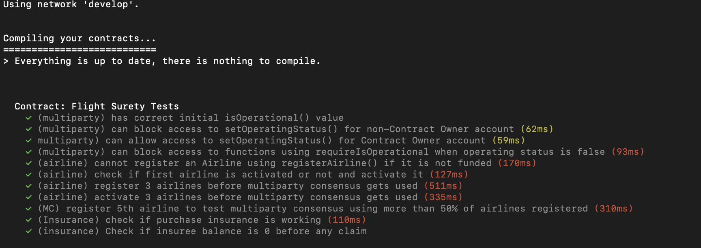
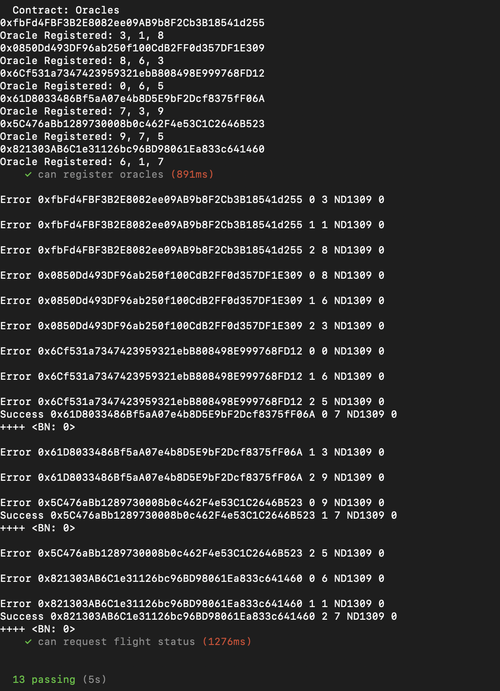
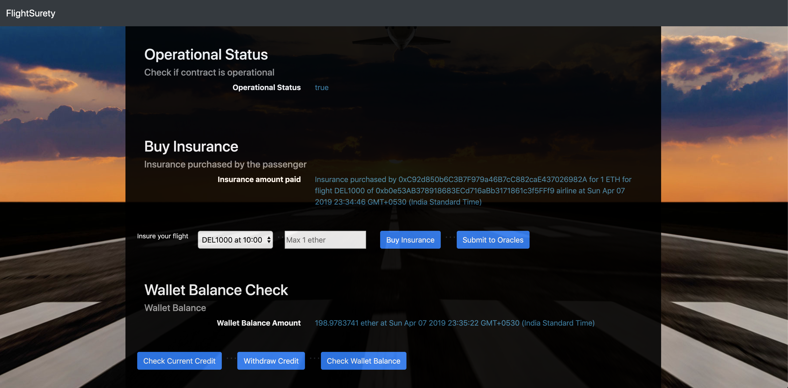

# FlightSurety

FlightSurety is a sample application project for Udacity's Blockchain course.

## Software tools requirements - 
cd into FlightSurety and run - npm install truffle-hdwallet-provider
1) Ganache - v1.2.2 - Mnemonic - wait worry size million cable awesome auto erode frog either rail notice
2) Truffle v5.0.11 (core: 5.0.11) - Mnemonic - shock amateur sausage obey segment decade render chair arch runway obscure school
3) Solidity - ^0.4.24 (solc-js)
4) Node v8.11.3
5) Web3.js v1.0.0-beta.37

## Install

This repository contains Smart Contract code in Solidity (using Truffle), tests (also using Truffle), dApp scaffolding (using HTML, CSS and JS) and server app scaffolding.

To install, download or clone the repo, then:

`npm install`
`truffle compile`

## Develop Client

To run truffle tests:

`truffle test ./test/flightSurety.js`
`truffle test ./test/oracles.js`

## To run truffle tests for testing Airline section of the rubrics - 
1) Truffle develop
2) compile
3) Please change 2_deploy_contracts.js to add owner and firstAirline as first and second account from truffle test accounts.
4) migrate --reset
5) test

## Truffle test outputs

 

## Accounts Arrangement used through ganache
1) Configure 40 pre assigned accounts.
2) Account index 0 -> owner
3) Account index 1 -> firstAirline
4) Account index 2-4 -> Airlines
5) Account index 5-9 -> Passengers
6) Account index 21-39 -> Oracles

## To run dapp to test passenger and oracle secions from rubric
Please change 2_deploy_contracts.js to add owner and firstAirline as first and second account from ganache test accounts.

To use the dapp:

`truffle migrate`
`npm run dapp`

To view dapp:

`http://localhost:8000`

## Dapp View

## Develop Server

`npm run server`
`truffle test ./test/oracles.js`

## Deploy

To build dapp for prod:
`npm run dapp:prod`

Deploy the contents of the ./dapp folder

## Resources

* [How does Ethereum work anyway?](https://medium.com/@preethikasireddy/how-does-ethereum-work-anyway-22d1df506369)
* [BIP39 Mnemonic Generator](https://iancoleman.io/bip39/)
* [Truffle Framework](http://truffleframework.com/)
* [Ganache Local Blockchain](http://truffleframework.com/ganache/)
* [Remix Solidity IDE](https://remix.ethereum.org/)
* [Solidity Language Reference](http://solidity.readthedocs.io/en/v0.4.24/)
* [Ethereum Blockchain Explorer](https://etherscan.io/)
* [Web3Js Reference](https://github.com/ethereum/wiki/wiki/JavaScript-API)
